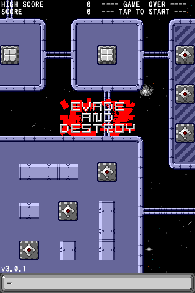

EVADE AND DESTROY
=================

HTML5 space shooter game using pure JavaScript

Description
-----------

**EVADE AND DESTROY** is a vertically scrolling shooter written in pure JavaScript (without any framework).

Playable Demo
-------------

You can play the game directly at <https://mikkun.github.io/evade-and-destroy/>.

If you want to play the game offline, you can install the game as a Progressive Web App.

Browser Support
---------------

**EVADE AND DESTROY** has been tested in the following browsers:

* Desktop
    * Chromium 71.0.3578.80: Very fast
    * Firefox 60.4.0: Very fast
    * Firefox Beta 65.0beta: Very fast
    * Internet Explorer 11: Very fast
    * Vivaldi 2.2.1388.34: Very fast
* Mobile
    * Chrome for Android 71.0.3578.98: Very fast
    * Firefox for Android 63.0.2: Very fast

How to Play
-----------

### Controls ###

* Desktop
    * <kbd>Mouse left/right</kbd>: Move the spaceship left/right on the horizontal axis
    * <kbd>Mouse over the button</kbd>: Fire
* Mobile
    * <kbd>Swipe left/right</kbd>: Move the spaceship left/right on the horizontal axis
    * <kbd>Touch the button</kbd>: Fire

### Power-Up Items ###

*  - __Plasma Cannon__ - Increases fire power. Max ammo is 600 shots.
*  - __Invincible__ - Temporary invincibility.
*  - __Flash Bomb__ - Destroys all enemies on the screen.

### Extra Lives ###

You start with three lives and get an extra life every 100,000 points.

Customizing the Map
-------------------

1. Edit TMX file(s) in the `maps/tmx` directory with [Tiled Map Editor](http://www.mapeditor.org/).
2. Execute the shell script in the `maps` directory to convert from TMX file(s) to JS file.
    1. Run `cd maps`.
    2. Run `./convmap-bg01.sh`, `./convmap-bg02.sh`, or `./convmap-enemies.sh` to suit your needs.
3. Move the generated JS file to `docs/js` directory.

The following table shows the correspondence between the shell scripts, source files, and destination files.

| Script Name          | TMX-Sourcefile(s) | Target Layer | JS-Destfile      |
| -------------------- | ----------------- | ------------ | ---------------- |
| `convmap-bg01.sh`    | `starfield.tmx`   | bg01         | `map-bg01.js`    |
| `convmap-bg02.sh`    | `area-[0-7].tmx`  | bg02         | `map-bg02.js`    |
| `convmap-enemies.sh` | `area-[0-7].tmx`  | enemies      | `map-enemies.js` |

Author
------

[KUSANAGI Mitsuhisa](https://github.com/mikkun)

License
-------

[MIT License](./LICENSE)
